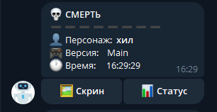
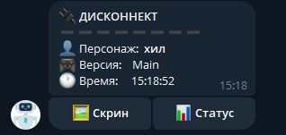
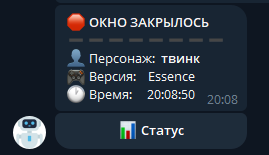
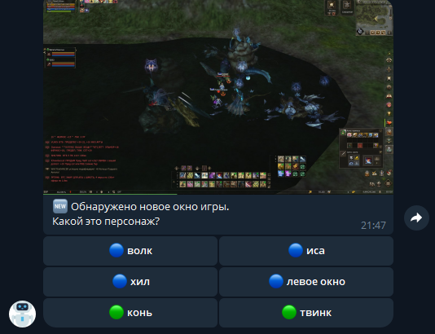
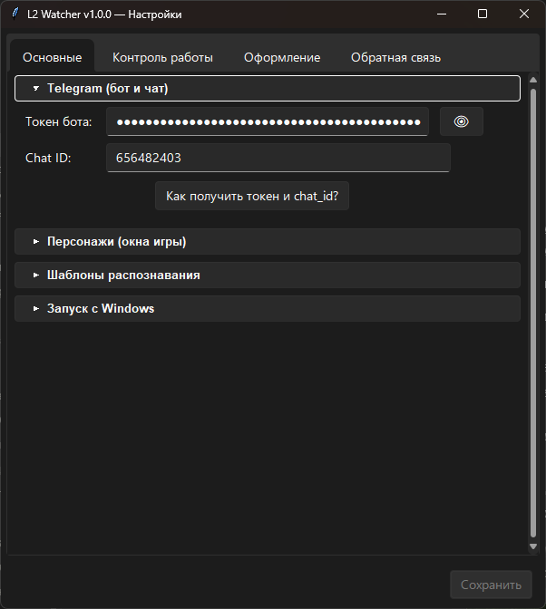
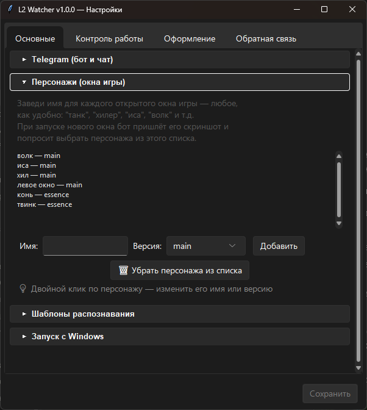
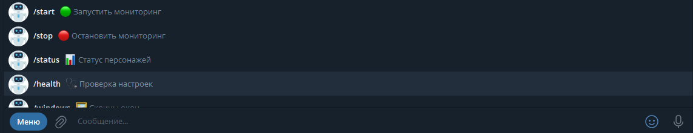

# L2 Watcher

Мониторинг окон Lineage II с уведомлениями в Telegram: смерть персонажа, дисконнект, закрытие окна (вылет/крит). Работает через захват экрана — **без чтения памяти игры, без инжектов, без хуков**. Для игры это обычная программа-скриншотилка.

<p align="center">
    
</p>

## Возможности

- 💀 Уведомление о смерти персонажа
- 🔌 Уведомление о дисконнекте («Соединение с сервером потеряно»)
- 🛑 Уведомление о закрытии окна игры (вылет/крит)
- 🖼 Скриншот окна прямо в Telegram по кнопке
- Несколько окон одновременно (мультибокс), версии Main и Essence
- Самообучение: приложение само учится распознавать таблички твоего клиента
- 🌙 Тихий режим по расписанию (ночью не сканирует — ноль нагрузки)
- 4 стиля оформления уведомлений
- Управление кнопками в Telegram, без команд руками

<p align="center">
  
</p>

## Как это работает

Приложение периодически (раз в несколько секунд) делает скриншот каждого окна L2 и сравнивает его с эталонными картинками табличек смерти/дисконнекта (OpenCV matchTemplate). Эталоны создаются один раз при обучении — на твоём клиенте, в твоём разрешении. При совпадении шлёт уведомление в твой Telegram через твоего собственного бота.

## Установка

### Вариант 1 — готовый .exe (проще)

1. Скачай архив из [Releases](../../releases)
2. Распакуй куда угодно, запусти `L2Watcher.exe`

> ⚠️ **Windows покажет предупреждение SmartScreen** («Windows защитила ваш компьютер») — это нормально для неподписанных программ. Нажми **«Подробнее» → «Выполнить в любом случае»**. Код открыт — можешь убедиться, что внутри ничего лишнего.

### Вариант 2 — из исходников

Нужен Python 3.11+ (Windows):

```
git clone <repo-url>
cd l2watcher
pip install -r requirements.txt
python main.py
```

## Первая настройка (5 минут)

1. **Создай своего Telegram-бота:** напиши [@BotFather](https://t.me/BotFather) → `/newbot` → получи токен
2. **Узнай свой chat id:** напиши [@userinfobot](https://t.me/userinfobot)
3. Запусти L2 Watcher → откроется окно настроек → вставь токен и chat id, добавь персонажей
4. Напиши своему боту `/start` в Telegram
5. Запусти окна игры — бот сам их найдёт и спросит, какой это персонаж
6. Пройди обучение шаблонов (бот проведёт по шагам: нужно один раз умереть в игре)

<p align="center">
   
</p>

## Важные требования

- **Окна игры должны быть развёрнуты** (не свёрнуты в панель задач). Свёрнутый DirectX-клиент не рендерит кадры — читать нечего. Окна могут перекрывать друг друга (для этого есть настройка «Читать перекрытые окна»).
- Шаблоны привязаны к разрешению: сменил разрешение клиента — переобучи (`/retrain`).

## Команды бота

<p align="center">
  
</p>

| Команда | Что делает |
|---|---|
| `/start` / `/stop` | Запустить / остановить мониторинг |
| `/status` | Статус персонажей |
| `/health` | Проверка настроек: что вижу и всё ли готово |
| `/windows` | Скрины открытых окон |
| `/redetect` | Переназначить окна (сменить персонажа окну) |
| `/retrain` | Переобучить шаблоны (с выбором версии и типа) |
| `/style` | Стиль оформления уведомлений |
| `/menu` | Все действия кнопками |
| `/feedback` | 🐞 Сообщить о проблеме |
| `/log` | Прислать лог файлом |

## Настройки

Окно настроек открывается из трея (правый клик по иконке). Там же: тихий режим по расписанию, автозагрузка, чтение перекрытых окон, стиль оформления, обратная связь.

Данные хранятся в `%APPDATA%\L2Monitor\` (конфиг, шаблоны, лог).

## FAQ

**Это не бан?** Приложение не читает память игры, не инжектится, не жмёт кнопки — только скриншоты окна снаружи, как OBS или любая скриншотилка.

**Антивирус ругается на .exe.** Ложное срабатывание на PyInstaller-сборку. Добавь в исключения или собери сам из исходников.

**Бот молчит.** Проверь `/health`. Частая причина в РФ — недоступен api.telegram.org (нужен VPN/прокси на системе). Приложение само переподключается, когда сеть вернётся.

**Дисконнект не ловится.** Убедись, что окно развёрнуто и шаблон обучен для нужной версии (Main/Essence — таблички разные, обучаются отдельно).

## Обратная связь

Нашёл баг или есть идея? Напиши в [@L2WatcherFeedbackBot](https://t.me/L2WatcherFeedbackBot) — сообщение попадёт напрямую разработчику.

Как сообщить о проблеме (любой из способов):
- в боте вотчера: `/feedback` или кнопка «🐞 Сообщить о проблеме» в `/menu`
- в настройках приложения: вкладка **«Обратная связь»**

Что указать: версию (видна в `/health`), что делал, что ожидал и что произошло. Лог сильно помогает: получи его командой `/log` и перешли файл фидбек-боту. Скрин приветствуется.

## Сборка .exe

```
build.bat
```

Результат в `dist\L2Watcher\`. Чистка мусора сборки — `clean.bat`.

## Лицензия

MIT
