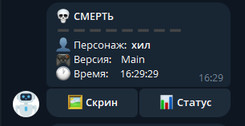
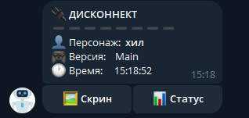
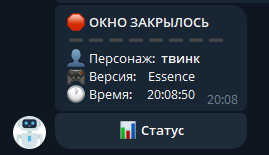
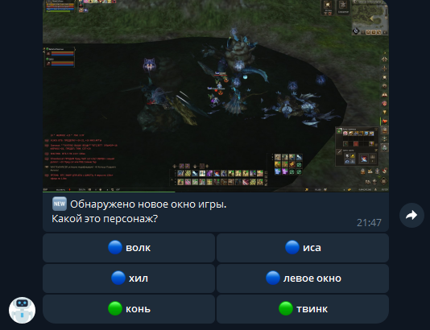
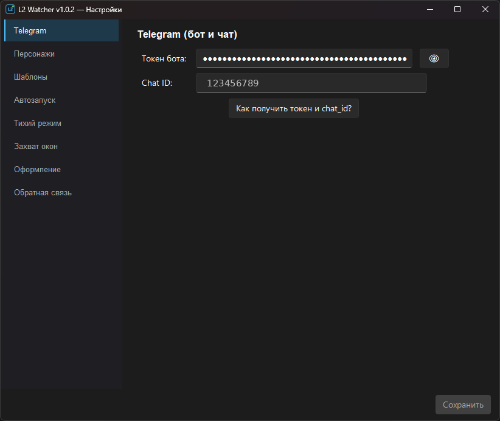
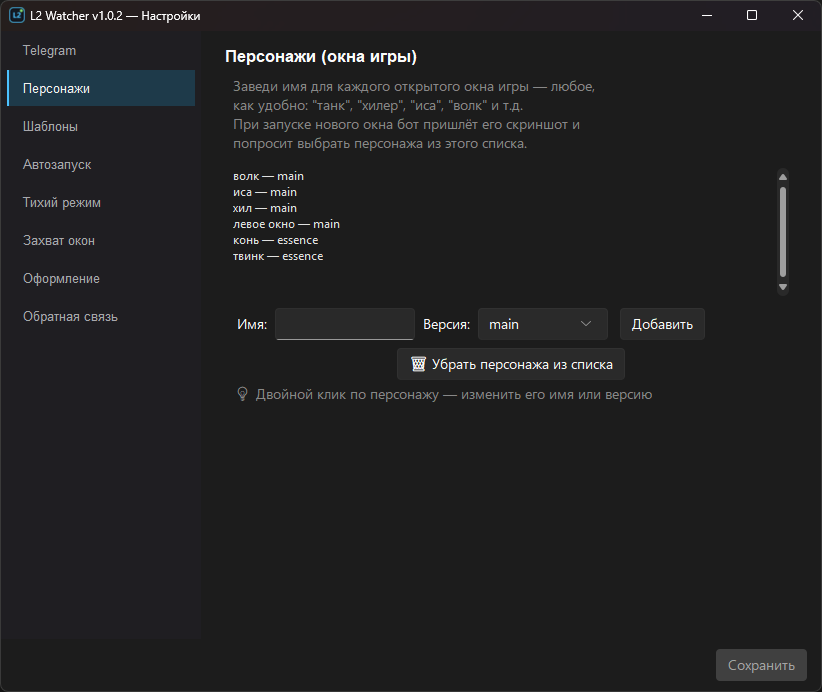
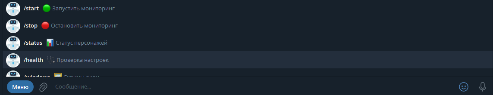

# L2 Watcher

Мониторинг окон Lineage II с уведомлениями в Telegram: смерть персонажа, дисконнект, закрытие окна (вылет/крит). Работает через захват экрана — **без чтения памяти игры, без инжектов, без хуков**. Для игры это обычная программа-скриншотилка.

<p align="center">
    
</p>

## Возможности

- 💀 Уведомление о смерти персонажа
- 🔌 Уведомление о дисконнекте («Соединение с сервером потеряно»)
- 🛑 Уведомление о закрытии окна игры (вылет/крит)
- 🖼 Скриншот окна прямо в Telegram по кнопке
- Несколько окон одновременно (мультибокс), версии Main и Essence
- Самообучение: приложение само учится распознавать таблички твоего клиента
- 🌙 Тихий режим по расписанию (ночью не сканирует — ноль нагрузки)
- 4 стиля оформления уведомлений
- Управление кнопками в Telegram, без команд руками

<p align="center">
  
</p>

## Как это работает

Приложение периодически (раз в несколько секунд) делает скриншот каждого окна L2 и сравнивает его с эталонными картинками табличек смерти/дисконнекта (OpenCV matchTemplate). Эталоны создаются один раз при обучении — на твоём клиенте, в твоём разрешении. При совпадении шлёт уведомление в твой Telegram через твоего собственного бота.

## Установка

### Вариант 1 — готовый .exe (проще)

1. Скачай архив из [Releases](../../releases)
2. Распакуй куда угодно, запусти `L2Watcher.exe`

> ⚠️ **Windows покажет предупреждение SmartScreen** («Windows защитила ваш компьютер») — это нормально для неподписанных программ. Нажми **«Подробнее» → «Выполнить в любом случае»**. Код открыт — можешь убедиться, что внутри ничего лишнего.

#### Проверка скачанного файла

Программа собрана без цифровой подписи: сертификат стоит от 100 $ в год и для
бесплатного проекта не окупается. Поэтому подлинность проверяется хешем.

В описании каждого релиза указан **SHA256** архива и ссылка на отчёт
**VirusTotal**. Сверить у себя:

```powershell
Get-FileHash L2Watcher_v1.1.0.zip -Algorithm SHA256
```

Совпало с тем, что в релизе — файл тот самый, по дороге его не подменили.

### Вариант 2 — из исходников

Подходит, если антивирус блокирует `.exe` (см. ниже) или просто не хочется
запускать чужой собранный файл. Нужен [Python 3.11+](https://www.python.org/downloads/)
— при установке обязательно поставь галочку **«Add Python to PATH»**.

```
git clone https://github.com/holarandom/L2Watcher.git
cd L2Watcher
pip install -r requirements.txt
python main.py
```

Дальше всё то же самое: откроется окно настроек, вводишь токен и chat_id.
Настройки и обученные шаблоны лежат там же, где у `.exe` — в
`%APPDATA%\L2Monitor\`, так что между способами запуска можно переключаться
свободно, ничего не потеряется.

Чтобы окно консоли не висело на экране, запускай через `pythonw`:

```
pythonw main.py
```

## Антивирус ругается на .exe

Иногда Windows Defender или другой антивирус помечает `L2Watcher.exe` как
угрозу — например `Trojan:Win32/Wacatac` — и отправляет файл в карантин.

**Это ложное срабатывание.** Вот почему оно происходит:

- Программа собрана упаковщиком **PyInstaller**: код распакововается в память
  при запуске. Точно так же устроены и вредоносные упаковщики — автоматика
  различить их не может, и любые PyInstaller-сборки регулярно попадают под
  раздачу.
- Файл **не подписан** — издатель для системы неизвестен.
- Программа **читает содержимое чужих окон** (иначе она не увидела бы табличку
  смерти) и **умеет запускаться вместе с Windows**. По отдельности всё безобидно,
  но вместе это формально совпадает с поведением шпионских программ.

Суффикс `!ml` в названии угрозы означает, что вердикт вынесла обученная модель,
а не совпадение с известным вирусом. То есть антивирус **предположил**, а не
нашёл.

### Что делать

**Способ 1 — запустить из исходников.** Самый чистый вариант: `.exe` не
используется вообще, значит и блокировать нечего. См. «Вариант 2» выше.

**Способ 2 — проверить и убедиться самому.** Сверь SHA256 с тем, что указан в
релизе, посмотри отчёт VirusTotal по ссылке оттуда же. Весь исходный код открыт
в этом репозитории — можно прочитать и собрать самому через `build.bat`,
результат будет тот же.

**Способ 3 — добавить исключение в антивирусе.** Работает, но делай это
осознанно и только если два предыдущих способа не подошли: «отключите
антивирус» — ровно то, что просят и настоящие вирусы. Не привыкай к такому.

Если файл уже съели: Безопасность Windows → Защита от вирусов и угроз →
Журнал защиты → найти запись → **Действия** → **Восстановить**.

## Первая настройка (5 минут)

1. **Создай своего Telegram-бота:** напиши [@BotFather](https://t.me/BotFather) → `/newbot` → получи токен
2. **Узнай свой chat id:** напиши [@userinfobot](https://t.me/userinfobot)
3. Запусти L2 Watcher → откроется окно настроек → вставь токен и chat id, добавь персонажей
4. Напиши своему боту `/start` в Telegram
5. Запусти окна игры — бот сам их найдёт и спросит, какой это персонаж
6. Пройди обучение шаблонов (бот проведёт по шагам: нужно один раз умереть в игре)

<p align="center">
   
</p>

## Важные требования

- **Окна игры должны быть развёрнуты** (не свёрнуты в панель задач). Свёрнутый DirectX-клиент не рендерит кадры — читать нечего. Окна могут перекрывать друг друга (для этого есть настройка «Читать перекрытые окна»).
- Шаблоны привязаны к разрешению: сменил разрешение клиента — переобучи (`/retrain`).

## Команды бота

<p align="center">
  
</p>

| Команда | Что делает |
|---|---|
| `/start` / `/stop` | Запустить / остановить мониторинг |
| `/status` | Статус персонажей |
| `/health` | Проверка настроек: что вижу и всё ли готово |
| `/windows` | Скрины открытых окон |
| `/redetect` | Переназначить окна (сменить персонажа окну) |
| `/retrain` | Переобучить шаблоны (с выбором версии и типа) |
| `/style` | Стиль оформления уведомлений |
| `/menu` | Все действия кнопками |
| `/feedback` | 🐞 Сообщить о проблеме |
| `/log` | Прислать лог файлом |

## Настройки

Окно настроек открывается из трея (правый клик по иконке). Слева — список разделов:

| Раздел | Что внутри |
|---|---|
| **Telegram** | токен бота и chat id |
| **Персонажи** | имена окон игры, версия (Main/Essence) |
| **Шаблоны** | статус обучения, переобучение, папка шаблонов |
| **Автозапуск** | запуск с Windows, старт мониторинга сразу |
| **Тихий режим** | пауза по расписанию (ночью не сканирует) |
| **Захват окон** | чтение перекрытых окон |
| **Оформление** | стиль уведомлений, формат выбора персонажа |
| **Обратная связь** | связь с разработчиком, папка с логом |

Данные хранятся в `%APPDATA%\L2Monitor\` (конфиг, шаблоны, лог).

## FAQ

**Это не бан?** Приложение не читает память игры, не инжектится, не жмёт кнопки — только скриншоты окна снаружи, как OBS или любая скриншотилка.

**Антивирус ругается на .exe.** Ложное срабатывание на PyInstaller-сборку. Добавь в исключения или собери сам из исходников.

**Бот молчит.** Проверь `/health`. Частая причина в РФ — недоступен api.telegram.org (нужен VPN/прокси на системе). Приложение само переподключается, когда сеть вернётся.

**Дисконнект не ловится.** Убедись, что окно развёрнуто и шаблон обучен для нужной версии (Main/Essence — таблички разные, обучаются отдельно).

**Пришла куча уведомлений об одной смерти.** Было в версиях до 1.0.3 и исправлено. Если обновился и всё равно повторяется — шаблон совпадает слишком слабо: переобучи его через `/retrain`. Проверить можно в логе: строки «БЛИЗКИЙ ПРОМАХ» показывают, насколько шаблон не дотягивает до порога.

**Когда придёт повторное уведомление?** Только если событие реально случилось заново: табличка ушла с экрана, а потом появилась снова. Пока табличка висит — бот молчит. Смерть и дисконнект считаются раздельно: если лежишь мёртвый и следом словил дисконнект, придут оба уведомления, но каждое по одному разу.

## Обратная связь

Нашёл баг или есть идея? Напиши в [@L2WatcherFeedbackBot](https://t.me/L2WatcherFeedbackBot) — сообщение попадёт напрямую разработчику.

Как сообщить о проблеме (любой из способов):
- в боте вотчера: `/feedback` или кнопка «🐞 Сообщить о проблеме» в `/menu`
- в настройках приложения: раздел **«Обратная связь»**

Что указать: версию (видна в `/health`), что делал, что ожидал и что произошло. Лог сильно помогает: получи его командой `/log` и перешли файл фидбек-боту. Скрин приветствуется.

## Сборка .exe

```
build.bat
```

Результат в `dist\L2Watcher\`. Чистка мусора сборки — `clean.bat`.

## Лицензия

MIT
